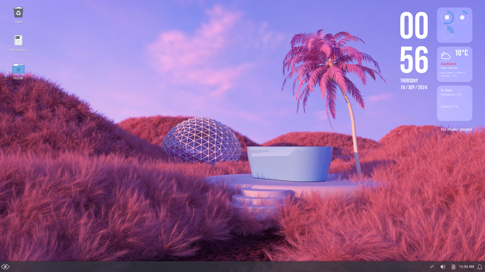

# Ricing instructions for Linux workshop

Here is what our desktop will like after this:



-# Yes, this was taken at 1 AM, deal with it.

## Themes

### Installing the themes

#### Base theme

This installs the base theme that will determine how everything looks. We will make more minor changes later.

All the commands below will be run within a terminal, which can be opened via the Application menu in the top left, and selecting Terminal Emulator, or just using the keyboard shortcut `Ctrl + Alt + T`.

```bash
# Installs some apps that the theme needs to work properly. Here, we're using the apt-get command, which installs packages (or apps and libraries) to the system. To write to the system, we need permission to do so, but normally our user doesn't have access, which is by design to protect the system. 
# You'd wonder, if we don't have permission, how do we install these then? Fear not, for sudo will save the day! The sudo command gives a user temporary root access, which is needed to write to the system files.
sudo apt-get install gtk2-engines-murrine gtk2-engines-pixbuf

# Change the (c)urrent (d)irectory to the folder that has our .zip files within it.
cd Downloads/

# Unzips the file that has our theme in it.
unzip Qogir-theme-master.zip

# Change the current directory to the folder that has the theme in it
cd Qogir-theme-master/

# Runs a script (denoted by .sh) to install the theme
./install.sh

# Adds a tweak to round some corners. We all love round corners, don't we? Wdym you don't? Also, you will be asked for the root password here.
./install.sh --tweaks round
```

#### Icons

This section installs the icons for the theme, which work with the theme to create a consistent look. It wouldn't look great if your theme was black and yellow, and then your icons were green would it?
```bash
# Move our open directory back to Downloads. Using .. means the previous folder, and a single dot (.) means the current folder.
cd ../

# Unzips the file that has the icons. Surely you get the gist by now
unzip Qogir-icon-theme-master.zip

# Change the folder to the icon theme folder
cd Qogir-icon-theme-master/

# Installs the theme
./install.sh
```

#### Cursors

While we're in this folder, we also need to install the cursor theme, which isn't done with this script, which isn't great, but more stuff to learn I guess.

```bash
# Go to the folder with the cursor themes
cd src/cursors/

# Since the cursor themes are going to be installed for all users, they need to be installed to a directory we don't have permission to write to. Hence, we're going to use the sudo command.
sudo ./install.sh
```

#### Fonts

Now, we will change some fonts, to make everything look just a little bit better. 

```bash
# Go back to Downloads. ~ represents the home folder for our user, or the equivalent of pressing home in the top left of our file manager. This is where all our stuff is stored.
cd ~/Downloads/

# extract the zip file
unzip fonts.zip

# We will copy the fonts to a folder to the local shared folder. This folder allows apps to access local shared resources, and by putting our fonts here, we allow the system to use these fonts for our user.
mv fonts/ ~/.local/share/
```

### Applying the themes

Now, we get to apply our themes and fonts, or in other words, taste the fruits of our labour!

#### System theme

Open Settings, which can be found from the applications menu in the top left, then through the Settings option, open Settings Manager.

Here, you can open the Appearance option, and here we'll change our themes.

- In the Style menu (the menu that opens initially), choose the `Qogir-Dark` theme. If you prefer a light mode, you can use `Qogir-Light`.
- In the Icons menu, choose the `Qogir-dark` icon theme. `Qogir-light` is the light mode alternative.
- In the Fonts menu, select the default font, and search for `Roboto Regular`, then select `Roboto Regular`.
- Open the monospace font, and search for `Meslo`. You can select the `MesloLGS NF Regular` font here.

#### Window manager theme

To finish setting the themes, we need to change the borders of our windows as well, also known as the Window Manager theme, since we're changing the theme of the service that manages our windows.

To do this, we can;

- Go back to the main settings screen, by pressing All Settings in the bottom right,
- Go to the Window Manager settings,
- Under style, change the theme to `Qogir-Dark`, or `Qogir-Light` for the light mode alternative.

We're also going to change the formatting of the top bar, and the font.

- Change the title font to `Roboto Bold`,
- Change the button layout;
  - We're going to remove the arrow, next to the right close buttons. We can remove it, by dragging it from the "active" button set, to the "hidden" set below.
  - We're also going to remove the 3 dots on the left side, by dragging it down as well.
  - In the end, it should like `[          Title          ][-][☐][×]`

#### Cursor theme

We can also apply the cursor theme, since I think the default one kinda sucks.

- Go back to the main settings screen, and open Mouse and Touchpad.
- Within the Theme section, set the cursor to the `Qogir Cursors` option. You can choose the `Qogir-white Cursors` option if you want more contrast, or you chose a light mode theme above.

### Wallpaper

We've included a few wallpapers, which you can use here. We're going to extract the wallpaper.zip file, move the wallpapers to a sane folder, then apply one.

```bash
# You can press Tab while typing the filename to have the shell auto-complete it for you. For example, pressing tab while I've only written "unzip wall" will complete it, since there's only one file that starts with "wall".
unzip wallpaper.zip

mv wallpaper/ ~/.local/share/wallpapers/ # Move the wallpapers to the shared local resources under the wallpapers/ folder.
```

Once this is done, you can either right click on the desktop and press desktop settings, or go to Desktop from settings, to open the settings for the desktop. You can then see that our wallpapers *aren't* there. We can fix this by changing the folder set at the bottom, by pressing the option, and pressing Other...

From here, we can choose the folder Home, in the top left, to go back to the home folder for our user. Once here, we need to press `Ctrl + H`, since the `.local/` folder is hidden. It is a hidden folder, since the name of it is prefixed by a dot (.). All files and folders prefixed with a dot are hidden, and can be seen with a `Ctrl + H`. Once you can see the folder, go to `.local/share/wallpapers/`, and hit open. From here, choose any wallpaper you like.

You can close settings after this. We won't need it for a while.

#### Wallpaper app

*This app is quite buggy so use it as you see fit.*

A `.appimage` file is included in the Downloads folder, which you may see. We can try running it, with the syntax below.

```bash
./Wonderwall-x86_64.Appimage
```

You might see that it says, `Permission denied`, or something similar. This is because the app doesn't have permission to be run. We can give it the permission to be run with the below;

```bash
# +x marks the file as e(x)ecutable.
chmod +x Wonderwall-x86_64.Appimage
```

If you try to run Wonderwall again, you'll see that it works! You should change the option that says gnome to xfce4 (CHANGE ME), and then you can close the settings. You can then search for wallpapers and stuff here and set it if you need, but in our experience it isn't very consistent.

### Panel plugins

Now, we're going to change the bottom bar, so it looks a little nicer, via the [Docklike Plugin](https://github.com/nsz32/docklike-plugin)

```bash
# Install some packages needed for the plugin
sudo apt-get install xfce4-dev-tools libxfce4ui-2-dev libxfce4panel-2.0-dev git libwnck-3-dev build-essential

unzip docklike-plugin-master.zip

cd docklike-plugin-master/

# This will autogenerate some files needed for compilation, since we're making the plugin on the system ourselves, and some system-specific files are needed which can't be assumed.
./autogen.sh

# Compile, or make, the plugin
make

# Install it
sudo make install
```

Now, we're going to install some profiles for the bottom bar, via [xfce4-panel-profiles](https://github.com/xfce-mirror/xfce4-panel-profiles), which will allow us to utilise the above plugin, and also allow us to use our own profile, which should make the bar look much better.

```bash
cd ../

unzip xfce4-panel-profiles-master.zip

cd xfce4-panel-profiles-master/

# This is the same as ./autogen, but it's used here since the creator of the plugin used a different build system.
./configure

# The same build and install
make

sudo make install
```

#### Debugging

Now, let's try to open the Panel Profiles from the top left menu (try searching for it). Note that nothing is happening. It doesn't seem to open. Let's try to figure out what's going on.

We can go back to our terminal, and try running the plugin to see why it isn't opening.
```bash
xfce4-panel-profiles
```

Note that it says `ModuleNotFoundError: No module named 'psutil'`. We can see this by looking at the last line of the whole error, shared below for brevity.

```python
Traceback (most recent call last):
  File "/usr/local/share/xfce4-panel-profiles/xfce4-panel-profiles/xfce4-panel-profiles.py", line 45, in <module>
    from panelconfig import PanelConfig
  File "/usr/local/share/xfce4-panel-profiles/xfce4-panel-profiles/panelconfig.py", line 19, in <module>
    import psutil
ModuleNotFoundError: No module named 'psutil'
```

From this whole error output, we can see a few things:

- We're missing a module called `psutil`.
- The output looks like Python (due to the `.py` suffixes on the file names)

This might signify that we need to install something, maybe related to `psutil` and Python in some way. If you were to search this (along with the Linux Distribution name), you might come up with the solution! (You don't need to search it) The solution comes up [here](https://stackoverflow.com/a/68322117), which states that we need to run the below:

```bash
sudo apt-get install python3-psutil 
```

Once this is installed, we can try running `xfce4-panel-profiles` in the terminal again and see if it works. If it works, great job!

### Panel profile

We can now extract our profile from a zip, and apply it.

```bash
cd ../

unzip xfce4.zip
```

We can now open the Panel Profiles app, and then load our profile. This can be done by;

- Pressing the Import button on the bottom bar (the last button out of the 5)
- Navigating to `~/Downloads/xfce4/` and selecting `xfce4-panel-conf.tar.bz2`, pressing open
- Naming the config something sane, such as "Nice Profile". It doesn't really matter.
- Selecting the newly created profile, which should be at the top.
- Press apply when the profile is selected, by pressing the button with 2 cogs on it, which should say Apply Configuration when you hover over it. You don't need to make a backup of the current profile.
- Press close.

### Start menu settings

We can unzip the icons, move them to a sane folder, then select whichever one you like.

```bash
unzip start_menu_icons.zip

mv start_menu_icons/ ~/.local/share/icons/start_menu_icons/
```

Once this is done, you can right click on the start menu icon in the bottom left, and then press Properties.
From here, you can change all the settings of the start menu. We only want a few settings to be changed here.

Firstly, we can change the way the apps show up in the menu, by changing the option in the top to "Show as list".

Secondly, we should to change the settings below it, to have it be more readable and usable overall. We only need to change one thing, which is to enable positioning the categories, with the option " Position categories next to panel button"

We can also change the icon sizes, to make the app icon sizes to be of the "Small" size.

To match the theme, change the background opacity to 99 (not 100).

We can now set the start menu icon, by going to the Panel Button section in the top.

From here, we can press the big icon which has the 9 dots, which should (slowly) load all the icons. Patience is key.

Once it loads, you need to change the icon selection from "Status Icons" in the top, to "Image Files". Once you've done this, you can navigate to `~/.local/share/icons/start_menu_icons/`, and then choose any of the icons you like here.

The one used in the screenshot is the `diamond-square-symbolic.svg` icon.

You can now close the properties menu.

### Panel theming

As you may notice, the icons in the panel might seem a bit ... big ... let's say. We should probably fix that.

```bash
unzip whisker-menu.gtk.css.dark.zip

mv gtk.css ~/.config/gtk-3.0/gtk.css

# Restart the panel to load the new theme
xfce4-panel -r
```

## Desktop features

### Conky

First, we'll install a nice UI tool, called Conky, that shows some system information and other stuff (just like widgets on your phone).

```bash
sudo apt-get install conky-all

# This is run to ensure that it was installed correctly
conky --version
# If it spams the terminal with a bunch of stuff, it's working.

# We'll install a custom configuration for conky, since the default one sucks to be honest.
unzip conky.zip

mv conky/ ~/.config/conky
```

Now, we want Conky to start when we turn the system on, which we can do with auto-start files.

This can be done by opening Settings, and then going to Session and Startup at the bottom. From here, select the Application Autostart submenu at the top, and press the + at the bottom to add a new app.

Here, you want to call the new app Conky, Here, you want to call the new app Conky. We need to navigate to the path that has our custom config, which we can do by going to `~/.config/conky/Regulus/start.sh`. Once done, press OK, then OK again.

You can close the settings now, since we don't need it anymore.

For one of the widgets, particularly the weather widget, it needs a few more dependencies to be installed;
```bash
sudo apt-get install jq curl
```

To ensure that the weather script is getting the correct weather data, we need to change the city ID. We also need to change the API key since the one within the script doesn't work.

Go to your terminal, and open the weather script in a text editor, with the command below.

```bash
nano ~/.config/conky/Regulus/scripts/weather.sh
```
Change the field `api_key`, so it has the value `36df37e5bcd35769bde02aff7da80002`, and the `city_id` field, so it has the city ID for Auckland, which is `2193733`.

To exit the text editor, the keyboard shortcuts `Ctrl + O`, to save the file, and `Ctrl + X`, to close the file, can be used. Make sure to press enter after saving to ensure that you've written the data back to the file, since the command asks where to save the file.

### Music visualiser

There is a cool applet called [glava](https://gitlab.com/wild-turtles-publicly-release/glava/glava), which can visualise music, which is quite nice.

```bash
unzip glaza-master.zip

cd glava-master

sudo apt-get install libgl1-mesa-dev libpulse-dev liblua5.3-dev lua-lgi lua-filesystem libobs0 libobs-dev meson

meson build --prefix /usr

ninja -C build

sudo ninja -C build install

# Install the default theme
glava --copy-config
```

Now, we want to install our themes, but first, we need to back up some files we don't need.
```bash
cd ~/.config/glava/

# Move the old files to a prefix that won't be used.
mv bars.glsl bars.glsl-00
mv rc.glsl rc.glsl-00
```

Now, we can install our themes! (Technically they aren't themes but really it doesn't matter here).

```bash
cd ../

unzip glava-conf.zip

cd glava-conf/

# Move the new shader files into the config folder, all at once.
mv *.glsl ~/.config/glava/.

# We also want the visualiser to auto-start along with Conky, so we can move the .desktop file to the auto-start folder, which will auto start it. This is equivalent to what we did in Settings with Conky.
mv glava.desktop ~/.config/autostart/glava.desktop

# You can run the below to test it out
glava --desktop
```

After all these steps, you're done! To ensure everything is working, a quick restart will make sure that everything is up and running.

You can close the terminal by typing `exit` and hitting Enter, then going to the start menu and pressing the right arrow in the circle, which signifies the logout menu. In here, press restart, then log in again and see your beautiful rice <3!


## Credits / Acknowledgments

- **[Vandan Bhatt](https://github.com/unix2dossss)** - Performed all the ricing and customization.
- **[parmjotsinghrobot](https://github.com/parmjotsinghrobot)** - Rewrote the documentation neatly and comprehensively.
- **[Jared Daniel Recomendable](https://github.com/JDCRecomendable)** - Proofread the documentation and tested the rice on UTM.
